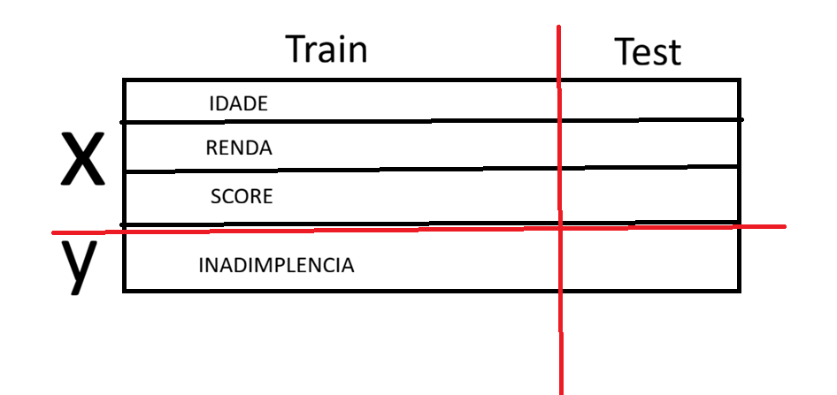

Anotações - Aula 03

O que é uma rede neural

como funciona a rede neural humana para entender como funciona a de maquina

o primneiro modelo matematico de um neuronio artificial foi em 1943

tipos diferentes de rede neural

entrada - ocultas - saida

curva auc nunca é bonitinha, sempre com subidas e descidas (melhorou: sobe, piorou: desce)

epoch são as rodadas de treinamemnto: tenho um dataset de 300 dados, passo os 300 treianndo a rede, foi-se a primeira epoch ....

algoritimo de random forest

se temso um dataset com campos de idade, renda, score e inadimplencia, em um sistema que tem como objetivo avaliar se é inadimplente ou não, e esse dataset será utilizado para treinar uma rede neural, o correto é:
    estrair este campo inadimplencia que será a saida, guardando em um novo dataset(df) sendo este o y, e o conjunto restante total dos dados é o x.

amostragens:
- Amostragem aleatoria simples: aleatoriedade(ex: 2, 53, 79...)
- amostragem sistematica: contendo uma lógica simples de escolha(ex: 1, 11, 21...)
- Amostragem estratificada: ?

---
---
---

